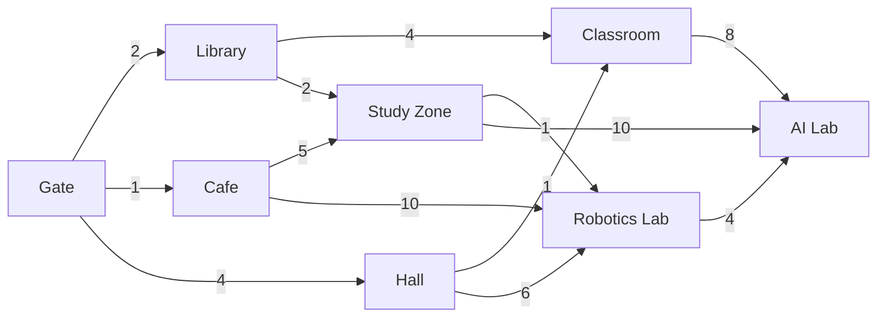

# Practical Work №2  
## DFS, BFS, UCS және A* іздеу алгоритмдерін салыстыру

### Мақсаты

Іздеу алгоритмдерінің жұмыс істеу принципін түсіну, оларды графтағы есепті шешуге қолдану және нәтижелерін салыстыру.

---

## 1. Өз мысалым

Бұл жұмыста университет ішінде қозғалатын робот қарастырылады.

Роботтың мақсаты — университеттің негізгі кіреберісінен AI зертханасына жету.

- **Start:** Gate
- **Goal:** AI Lab

Графта 8 түйін және 13 бағытталған байланыс бар.

---

## 2. Граф



Қабырғалардағы сандар роботтың бір орыннан екінші орынға өту құнын көрсетеді.

---

## 3. Graph representation

Python тілінде граф dictionary арқылы көрсетілді:

```python
graph = {
    "Gate": [("Library", 2), ("Cafe", 1), ("Hall", 4)],
    "Library": [("Classroom", 4), ("Study Zone", 2)],
    "Cafe": [("Study Zone", 5), ("Robotics Lab", 10)],
    "Hall": [("Classroom", 1), ("Robotics Lab", 6)],
    "Classroom": [("AI Lab", 8)],
    "Study Zone": [("Robotics Lab", 1), ("AI Lab", 10)],
    "Robotics Lab": [("AI Lab", 4)],
    "AI Lab": []
}
```

---

# 4. DFS — Depth-First Search

DFS бір бағыт бойынша мүмкіндігінше терең қозғалады.

DFS **stack (LIFO)** құрылымын қолданады.

### Нәтиже

**Қаралған түйіндер:**

`Gate → Library → Classroom → AI Lab`

**Табылған жол:**

`Gate → Library → Classroom → AI Lab`

**Жол құны:**

`2 + 4 + 8 = 14`

DFS мақсатты тез тапты, бірақ ең арзан жолды таппады.

---

# 5. BFS — Breadth-First Search

BFS графты деңгей бойынша қарайды.

BFS **queue (FIFO)** құрылымын қолданады және ең аз қадамнан тұратын жолды табуға тырысады.

### Нәтиже

**Қаралған түйіндер:**

`Gate → Library → Cafe → Hall → Classroom → Study Zone → Robotics Lab → AI Lab`

**Табылған жол:**

`Gate → Library → Classroom → AI Lab`

**Қадам саны:** 3

**Жол құны:**

`2 + 4 + 8 = 14`

BFS ең аз қабырғадан тұратын жолды тапты, бірақ weighted graph болғандықтан бұл ең арзан жол емес.

---

# 6. UCS — Uniform Cost Search

UCS әр уақытта бастапқы түйіннен ең аз жинақталған құны бар жолды таңдайды.

UCS үшін:

`g(n)` — Start түйінінен ағымдағы түйінге дейінгі нақты құн.

### Нәтиже

**Қаралған түйіндер:**

`Gate → Cafe → Library → Hall → Study Zone → Classroom → Robotics Lab → AI Lab`

**Табылған жол:**

`Gate → Library → Study Zone → Robotics Lab → AI Lab`

**Жол құны:**

`2 + 2 + 1 + 4 = 9`

UCS ең арзан жолды тапты.

---

# 7. A* Search

A* алгоритмі нақты жол құны мен heuristic мәнін бірге қолданады.

Формула:

`f(n) = g(n) + h(n)`

Мұнда:

- `g(n)` — Start-тан ағымдағы түйінге дейінгі нақты құн;
- `h(n)` — Goal-ға дейінгі болжамды қалған құн;
- `f(n)` — түйіннің жалпы бағасы.

### Heuristic values

| Node | h(n) |
|---|---:|
| Gate | 9 |
| Library | 7 |
| Cafe | 10 |
| Hall | 9 |
| Classroom | 8 |
| Study Zone | 5 |
| Robotics Lab | 4 |
| AI Lab | 0 |

Бұл кіші графта heuristic мәндері мақсатқа дейінгі ең арзан қалған құннан аспайды.

Мысалы, `Study Zone` түйінінде:

`g(n) = 4`

өйткені:

`Gate → Library → Study Zone`

`2 + 2 = 4`

Ал:

`h(n) = 5`

Сонда:

`f(n) = 4 + 5 = 9`

### Нәтиже

**Қаралған түйіндер:**

`Gate → Library → Study Zone → Robotics Lab → AI Lab`

**Табылған жол:**

`Gate → Library → Study Zone → Robotics Lab → AI Lab`

**Жол құны:**

`9`

A* UCS сияқты ең арзан жолды тапты, бірақ heuristic көмегімен аз түйін қарады.

---

# 8. Алгоритмдерді салыстыру

| Алгоритм | Табылған жол | Қадам | Cost | Expanded түйіндер |
|---|---|---:|---:|---:|
| DFS | Gate → Library → Classroom → AI Lab | 3 | 14 | 4 |
| BFS | Gate → Library → Classroom → AI Lab | 3 | 14 | 8 |
| UCS | Gate → Library → Study Zone → Robotics Lab → AI Lab | 4 | 9 | 8 |
| A* | Gate → Library → Study Zone → Robotics Lab → AI Lab | 4 | 9 | 5 |

---

## 9. Сұрақтарға жауап

**Қай алгоритм мақсатты бірінші тапты?**

Осы мысалда DFS ең аз түйін қарап Goal-ға жетті.

**Қай алгоритм ең қысқа жолды тапты?**

DFS және BFS 3 қабырғадан тұратын жол тапты.

**Қай алгоритм ең арзан жолды тапты?**

UCS және A*.

Ең арзан жолдың құны — `9`.

**DFS және BFS айырмашылығы қандай?**

DFS бір бағыт бойынша терең қозғалады.  
BFS барлық көрші түйіндерді деңгей бойынша қарайды.

**BFS және UCS айырмашылығы қандай?**

BFS қадам санын есепке алады, бірақ қабырғалардың әртүрлі cost мәндерін таңдауда пайдаланбайды.

UCS ең кіші жалпы cost бар жолды іздейді.

**UCS пен A* айырмашылығы қандай?**

UCS тек `g(n)` мәнін қолданады.

A*:

`f(n) = g(n) + h(n)`

мәнін қолданады.

Сондықтан A* мақсатқа қай бағыт тиімді екенін heuristic арқылы болжай алады.

**Heuristic A* жұмысына қалай әсер етті?**

Heuristic A* алгоритмін AI Lab бағытына бағыттады.

Сондықтан A* UCS-пен бірдей ең арзан жолды тапқанымен, азырақ түйін қарады.

**Бұл мысалда қай алгоритм тиімді болды?**

A* тиімді болды.

Себебі ол ең арзан жолды (`cost = 9`) тапты және UCS-пен салыстырғанда аз түйін қарады.

---

# 10. Қосымша эксперимент

`Library → Study Zone` қабырғасының құнын:

`2 → 8`

деп өзгертейік.

Бастапқы жағдайда ең арзан жол:

`Gate → Library → Study Zone → Robotics Lab → AI Lab`

Cost:

`2 + 2 + 1 + 4 = 9`

Cost өзгергеннен кейін бұл жол:

`2 + 8 + 1 + 4 = 15`

болады.

Сондықтан жаңа тиімді жол:

`Gate → Cafe → Study Zone → Robotics Lab → AI Lab`

Cost:

`1 + 5 + 1 + 4 = 11`

UCS және A* графтағы cost өзгерген кезде жаңа арзан маршрутты таңдай алады.

---

# 11. Қорытынды

Практикалық жұмыста DFS, BFS, UCS және A* алгоритмдері бір графта салыстырылды.

DFS терең іздеуді қолданады және әрқашан оптималды жолға кепілдік бермейді.

BFS қадам саны бойынша қысқа жолды табады.

UCS қабырғалардың cost мәндерін ескеріп, ең арзан жолды табады.

A* cost және heuristic ақпаратын бірге пайдаланады.

Берілген мысалда A* ең тиімді алгоритм болды, себебі ол ең арзан жолды тауып, UCS-ке қарағанда аз түйін қарады.

---

## Python коды

Толық Python коды осы репозиторийдегі:

`main.py`

файлында орналасқан.
